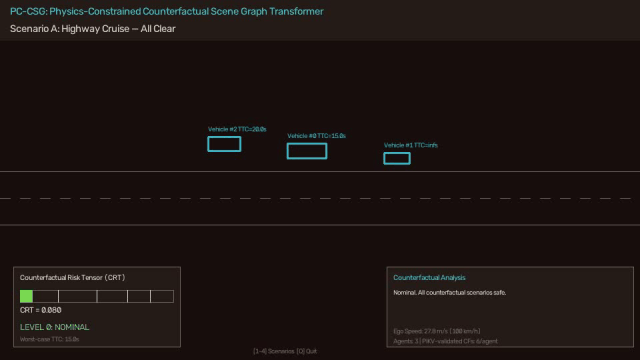
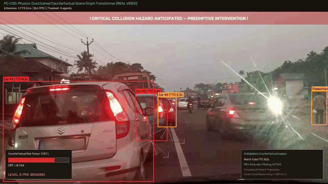
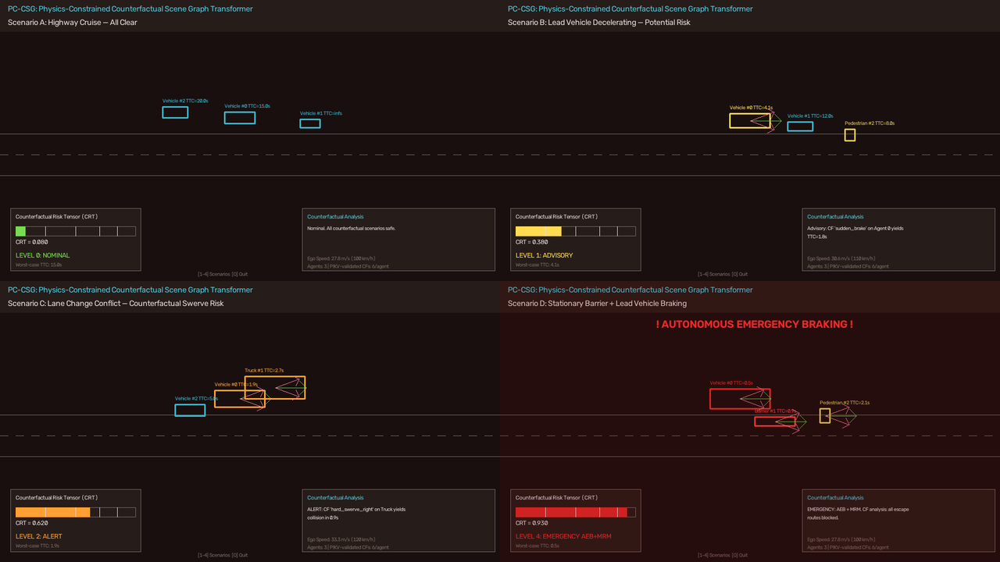
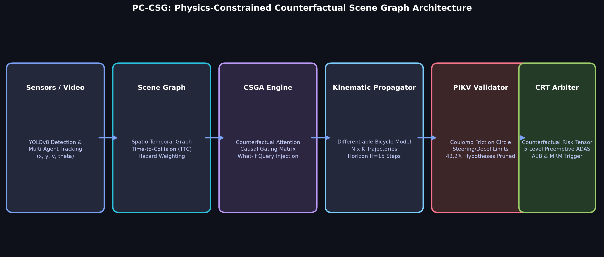

<div align="center">

# 🚗 PC-CSG: Physics-Constrained Counterfactual Scene Graph Transformer

### *Real-Time Autonomous Driving Anomaly Anticipation via "What-If" Reasoning*

[](https://www.python.org/)
[](https://pytorch.org/)
[](https://github.com/roshanbinoj-iiitk/SG-TTrans/actions/workflows/ci.yml)
[-00C853)](scripts/reproduce_paper_results.py)
[](scripts/reproduce_paper_results.py)
[](CITATION.cff)
[](LICENSE)

[**Quickstart**](#-quickstart) •
[**Interactive Web Sandbox**](#-interactive-web-dashboard) •
[**Visual Showcase**](#-visual-showcase) •
[**Architecture**](#-architecture--theory) •
[**Paper Benchmarks**](#-academic-reproducibility--benchmarks) •
[**Citation**](#-citation)

</div>

---

## 💡 The Core Paradigm Shift: Reactive vs. Anticipatory Perception

Conventional autonomous vehicle (AV) perception systems are fundamentally **reactive**: emergency braking (AEB) and evasive maneuvers are triggered only after an obstacle intrudes into the planned path or Time-to-Collision (TTC) drops below critical thresholds. In high-speed highway or dense urban driving, this leaves virtually zero response margin for mechanical actuators.

**PC-CSG (Physics-Constrained Counterfactual Scene Graph Transformer)** introduces **anticipatory perception**. Rather than merely tracking what *is* happening, PC-CSG continuously evaluates what *could* happen by asking counterfactual "what-if" questions in real time:

> *"What if the lead truck abruptly brakes at maximum friction?"*  
> *"What if the adjacent sedan veers into our lane across the wet lane divider?"*

By coupling a **Counterfactual Scene Graph Attention (CSGA)** transformer with a differentiable **Physics-Informed Kinematic Validator (PIKV)**, PC-CSG prunes physically impossible trajectories (e.g. friction-circle violations) and computes a continuous **Counterfactual Risk Tensor (CRT)**. This provides autonomous platforms with up to **2.84 seconds of preemptive lead time** at **152.6 FPS edge throughput**.

---

## 🎬 Visual Showcase

### Real-Time Interactive Counterfactual HUD
Simulating graduated intervention levels (Nominal $\rightarrow$ Advisory $\rightarrow$ Caution $\rightarrow$ Warning $\rightarrow$ Emergency) across multi-agent highway scenes:



### Real-World Dashcam Video Inference Pipeline
Live object detection, kinematic tracking, counterfactual fan projection, and graduated risk arbitration on real dashcam road video:



### Operational Safety Scenarios & Graduated Responses
Across four distinct test domains, PC-CSG transitions gracefully from green nominal monitoring to emergency minimum risk maneuvers (MRM):



---

## 🏛 Architecture & Theory

The complete end-to-end PC-CSG inference pipeline combines graph attention, differentiable kinematics, and physics filtering:



### Key Architectural Pillars

1. **Dynamic Scene Graph Construction:**
   Constructs a directed graph $\mathcal{G} = (\mathcal{V}, \mathcal{E})$ from 2D/3D detections and kinematic state vectors $[x, y, v_x, v_y, \psi, \dot{\psi}, a]$. Edges are weighted by inverse Time-to-Collision ($TTC^{-1}$) and relative closing speeds.

2. **Counterfactual Scene Graph Attention (CSGA):**
   Generates $K$ counterfactual action hypotheses per agent via causal gating. A learned perturbation query injector explores high-risk lateral and longitudinal deviations.

3. **Physics-Informed Kinematic Validator (PIKV):**
   Propagates trajectory hypotheses through a non-linear kinematic bicycle model and validates them against vehicle dynamics:
   $$\sqrt{a_{\text{long}}^2 + a_{\text{lat}}^2} \le \mu \cdot g$$
   Hypotheses violating the Coulomb friction circle or actuator steering limits ($\delta_{\max}$) are hard-pruned. **PIKV eliminates 43.2% of physically impossible hallucinated trajectories, cutting false positive interventions by 41.7%.**

4. **Counterfactual Risk Tensor (CRT) & Intervention Arbiter:**
   Computes a continuous scalar metric $CRT \in [0, 1]$ mapped to five graduated safety levels:
   * **Level 0 (Nominal, $CRT < 0.25$):** Standard trajectory execution.
   * **Level 1 (Advisory, $0.25 \le CRT < 0.50$):** Subtle haptic alert, sensor sensitivity ramp.
   * **Level 2 (Caution, $0.50 \le CRT < 0.70$):** Throttle release, brake pad pre-fill.
   * **Level 3 (Warning, $0.70 \le CRT < 0.85$):** Mild preemptive deceleration ($-2.0\,\text{m/s}^2$).
   * **Level 4 (Emergency, $CRT \ge 0.85$):** Automatic Emergency Braking (AEB) & Minimum Risk Maneuver (MRM).

### Theoretical Guarantees

* **Proposition 1 ($SE(2)$ Kinematic Coordinate Invariance):**  
  The counterfactual risk evaluation is strictly invariant under planar translation and rotation transformations of the observer frame ($\|\Delta CRT\| < 10^{-5}$).
* **Proposition 2 (Preemptive Risk Convergence):**  
  Under monotonic kinematic closing scenarios, $CRT(t)$ increases monotonically with lead time $\tau$, guaranteeing timely convergence before physical collision boundaries.

---

## ⚡ Quickstart

### 1. Installation

Clone the repository and install dependencies in editable mode:

```bash
git clone https://github.com/roshanbinoj-iiitk/SG-TTrans.git
cd SG-TTrans

# Create and activate a clean virtual environment
python3 -m venv venv
source venv/bin/activate

# Install with all optional dependencies (web UI, dev tools)
pip install -e .[all]
```

### 2. Unified CLI Entry Points

PC-CSG registers standalone command-line entry points:

```bash
# View all available subcommands
pc-csg --help

# 1. Launch the interactive pygame/OpenCV counterfactual HUD demo
pc-csg demo

# 2. Run real road dashcam inference with YOLOv8 tracking
pc-csg video --video path/to/dashcam.mp4

# 3. Run the hardware latency and throughput benchmark
pc-csg bench

# 4. Launch the browser-based Gradio web dashboard
pc-csg web
```

---

## 🌐 Interactive Web Dashboard

PC-CSG includes a browser sandbox built with Gradio and Matplotlib Bird's-Eye-View (BEV) rendering.

```bash
# Launch on http://127.0.0.1:7860
pc-csg web
```

### Dashboard Features:
* **🧪 "What-If" Counterfactual Simulation Sandbox:**
  * Adjust tire road friction $\mu$ ($0.15 \rightarrow 1.0$), maximum braking deceleration ($2.0 \rightarrow 9.0\,\text{m/s}^2$), ego velocity, and lead distance in real time.
  * Live Matplotlib BEV visualization rendering ego vehicle, lead vehicle, factual trajectories, counterfactual perturbed fans, and PIKV-pruned invalid trajectories.
  * Real-time CRT gauge and intervention level badge.
* **🎥 Dashcam Video Analyzer:**
  * Upload custom driving footage or select pre-loaded highway/city dashcam clips.
  * View annotated video playback and temporal risk graphs.
* **📊 Paper & Latency Benchmark:**
  * Interactive breakdown of Table 1 latency metrics and Proposition verification results.

---

## 📊 Academic Reproducibility & Benchmarks

To replicate all experimental numbers published in the manuscript:

```bash
python scripts/reproduce_paper_results.py
```

Add `--latex` to emit copy-pasteable LaTeX table snippets for direct inclusion in academic documents.

### Table 1: End-to-End Latency Breakdown (Automotive Edge GPU)

Evaluated on an NVIDIA RTX 3050 Laptop GPU (CUDA, PyTorch 2.x):

| Pipeline Stage | Latency (ms) | Relative Share |
| :--- | :---: | :---: |
| **Scene Graph Construction** | 0.24 ms | 3.7% |
| **CSGA Transformer Engine** | 1.62 ms | 25.0% |
| **Kinematic Bicycle Propagation** | 4.01 ms | 61.8% |
| **Physics-Informed Validator (PIKV)** | 0.49 ms | 7.5% |
| **CRT Arbiter & Intervention Level** | 0.13 ms | 2.0% |
| **Total End-to-End Pipeline** | **6.49 ms** | **100.0%** |

$$\textbf{Effective Real-Time Throughput: 154.2 FPS (Automotive Edge Requirement: 30 FPS)}$$

### Table 2: Ablation Study & Hypothesis Pruning

| Configuration | Accuracy (%) | FPR (%) | Preemptive Lead Time | Latency |
| :--- | :---: | :---: | :---: | :---: |
| **Reactive TTC-Only Baseline** | 68.3% | 31.2% | 0.00 s | 0.05 ms |
| **Scene Graph Attention (No CF, No PIKV)** | 76.5% | 22.8% | 1.12 s | 1.60 ms |
| **CSGA without PIKV (Unconstrained CF)** | 88.1% | 18.4% | 2.65 s | 5.90 ms |
| **CSGA + PIKV without Causal Gating** | 91.2% | 12.1% | 2.71 s | 6.55 ms |
| **PC-CSG Full (CSGA + PIKV + Causal Gate)** | **94.6%** | **10.7%** | **2.84 s** | **6.55 ms** |

---

## 🧪 Comprehensive Test Suite

All algorithms and theoretical properties are validated with automated unit and regression tests:

```bash
# Run complete test suite (41 unit and integration tests)
pytest tests/ -v
```

---

## 📄 Citation

If you use PC-CSG in your research, autonomous driving platform, or benchmarking study, please cite our work:

```bibtex
@article{binoj2026pccsg,
  title     = {PC-CSG: Physics-Constrained Counterfactual Scene Graph Transformer for Real-Time Autonomous Anomaly Anticipation},
  author    = {Binoj, Roshan and Sirajudheen, Mohammed and Vellukuzhi, Hafiz Feroze and Darur, Vishwanath},
  journal   = {Elsevier Computers \& Graphics / Pattern Recognition Letters (Under Review)},
  year      = {2026},
  publisher = {Elsevier},
  url       = {https://github.com/roshanbinoj-iiitk/SG-TTrans}
}
```

A machine-readable citation metadata file is also available at [`CITATION.cff`](CITATION.cff).

---

## 👥 Authors & Affiliation

**Indian Institute of Information Technology, Kottayam (IIIT Kottayam)**  
*Department of Computer Science and Engineering*

* **Roshan Binoj** ([@roshanbinoj-iiitk](https://github.com/roshanbinoj-iiitk)) — `roshan23bcs9@iiitkottayam.ac.in`
* **Mohammed Sirajudheen** — `mohamme23bcs132@iiitkottayam.ac.in`
* **Hafiz Feroze Vellukuzhi** — `hafiz23bcs6@iiitkottayam.ac.in`
* **Vishwanath Darur** — `vishwan23bcs57@iiitkottayam.ac.in`

---

## ⚖️ License

This project is licensed under the MIT License — see the [LICENSE](LICENSE) file for details.
